

<!-- EXACT REFERENCE: every visible module is an animated GIF -->
<a href="https://github.com/karthickchemist">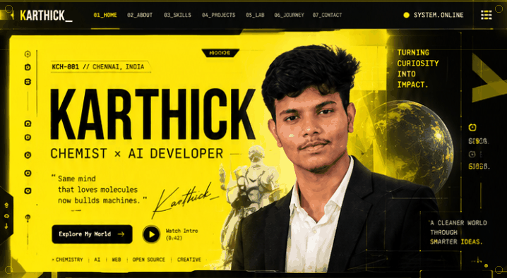</a>
<a href="https://github.com/karthickchemist">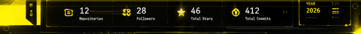</a>
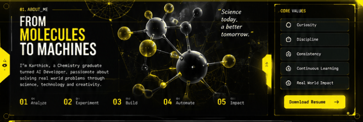
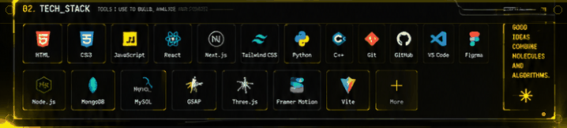
<a href="https://github.com/karthickchemist">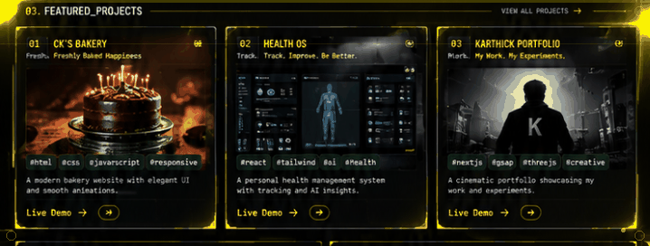</a>
<a href="https://github.com/karthickchemist">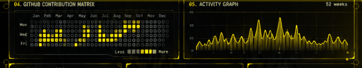</a>
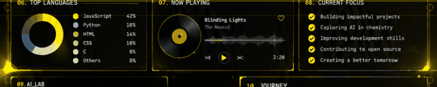
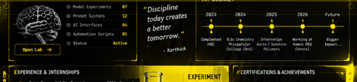
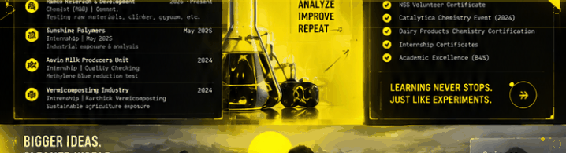
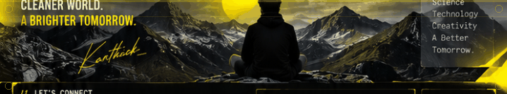
<a href="https://github.com/karthickchemist">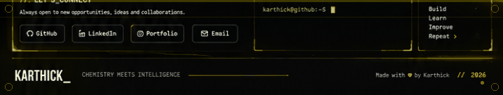</a>

