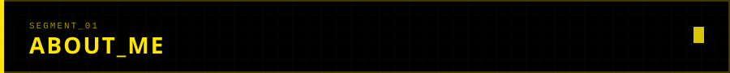
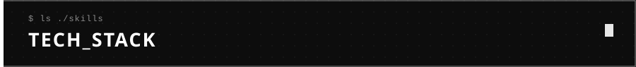
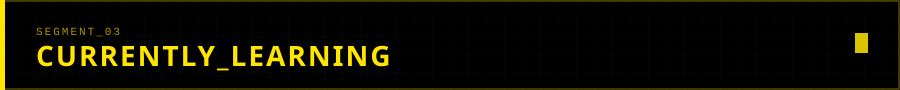
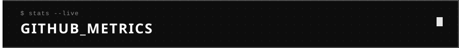
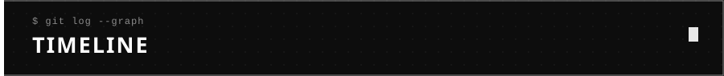

<div align="center">


[](https://t.me/Legend000001)


<br/>


</div>

<br/>

<table width="100%">
<tr>
<td width="60%" valign="top">



```yaml
name        : "Karthick"
role        : "AI-Integrated Web Developer"
background  : "B.Sc Chemistry Graduate"
location    : "Dindigul, Tamil Nadu, India"
focus       : ["Futuristic Interfaces", "Motion Design", "Applied AI Workflows"]
philosophy  : "From molecules to models — engineering intelligent systems."
status      : "ONLINE"
```

</td>
<td width="40%" valign="top" align="center">


</td>
</tr>
</table>

<br/>



**Frontend**


**Backend / Tools**


<br/>



```diff
+ Deep Learning Fundamentals
+ Prompt Engineering & Agentic Workflows
+ Advanced GSAP / Motion Systems
+ System Design for AI Products
```

<br/>



<div align="center">


<br/><br/>


</div>

<br/>



```ini
[SSC]                         ──────────
[HSC]                         ──────────
[B.SC. CHEMISTRY]             ──────────
         │
         ▼
[AI-INTEGRATED WEB DEVELOPER]  ← current
```

<br/>


<div align="center">

[](https://www.linkedin.com/in/karthickchemist)
[](mailto:youremail@example.com)
[](https://instagram.com/karthickchemist)
[](https://twitter.com/karthickchemist)

</div>

<br/>

<div align="center">


<p style="display: inline-block;" align="center">
         <p align="center">
  
   
   
   
   <br><br>
  <br><br>
</p>

<kbd>
    <kbd>Front-end</kbd>
    <br>
    <br>
     
     
    
  </kbd>
   <kbd>
    <kbd>Back-end</kbd>
    <br>
    <br>
    
    
     
    
  </kbd>
           <kbd>
    <kbd>Outros</kbd>
    <br>
    <br>
    
     
    
    
    
    
  </kbd>
</div>
