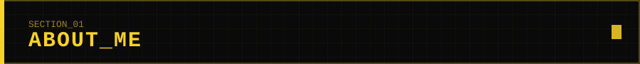

<div align="center">


<br/><br/>


</div>

<br/>



```yaml
name        : "Karthick"
role        : "AI-Integrated Web Developer"
background  : "B.Sc Chemistry Graduate"
location    : "Dindigul, Tamil Nadu, India"
focus       : ["Futuristic Interfaces", "Motion Design", "Applied AI Workflows"]
philosophy  : "From molecules to models — engineering intelligent systems."
status      : ONLINE
```

<br/>


<div align="center">


</div>

<br/>


<div align="center">


<br/><br/>


<br/><br/>


</div>

<br/>


<div align="center">

<a href="https://github.com/karthickchemist" target="_blank">

</a>
<a href="https://github.com/karthickchemist" target="_blank">

</a>

</div>

```diff
+ NOTE: replace "your-repo-1" / "your-repo-2" with your real repo names below
```

<br/>


```ini
[SSC]                       ────────────
[HSC]                       ────────────
[B.SC. CHEMISTRY]           ────────────
        │
        ▼
[AI-INTEGRATED WEB DEVELOPER]
```

<br/>


<div align="center">

<a href="https://www.linkedin.com/in/karthickchemist" target="_blank">

</a>
<a href="mailto:youremail@example.com" target="_blank">

</a>
<a href="https://instagram.com/karthickchemist" target="_blank">

</a>
<a href="https://twitter.com/karthickchemist" target="_blank">

</a>

</div>

<br/>

<div align="center">


</div>
