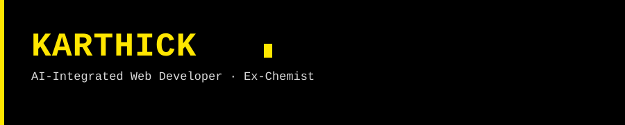

 

 

**Karthick** · B.Sc Chemistry graduate, now building AI-integrated web interfaces. Based in Dindigul, Tamil Nadu.

 

 

 

<!-- SNAKE_GRAPH_START -->
<picture>
  <source media="(prefers-color-scheme: dark)" srcset="https://raw.githubusercontent.com/karthickchemist/karthickchemist/output/snake-dark.svg" />
  <source media="(prefers-color-scheme: light)" srcset="https://raw.githubusercontent.com/karthickchemist/karthickchemist/output/snake.svg" />
  
</picture>
<!-- SNAKE_GRAPH_END -->

 

 

black × yellow · minimal · always shipping

